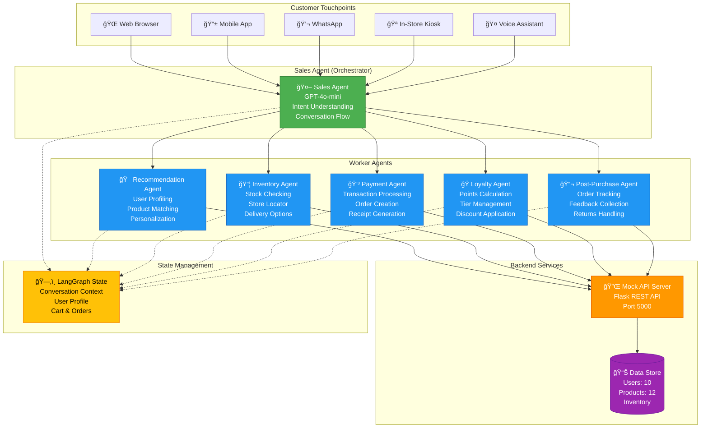
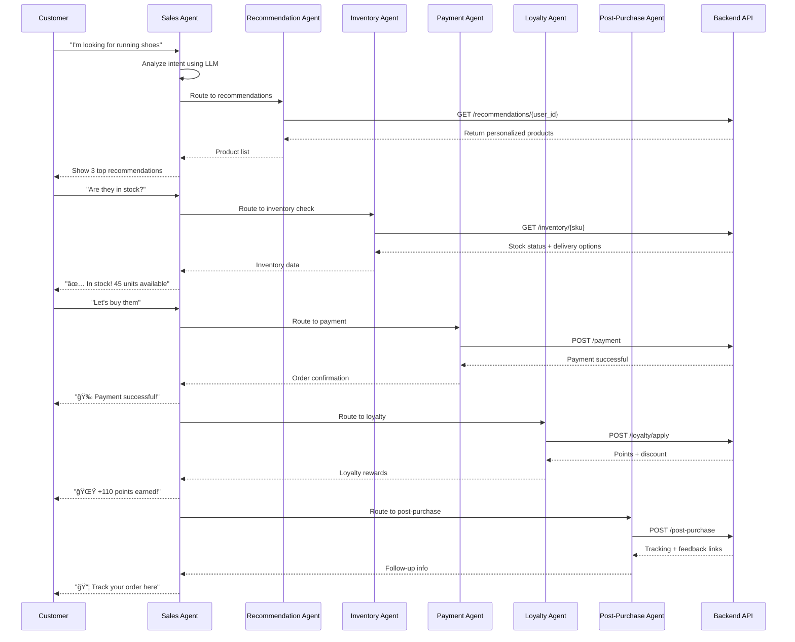
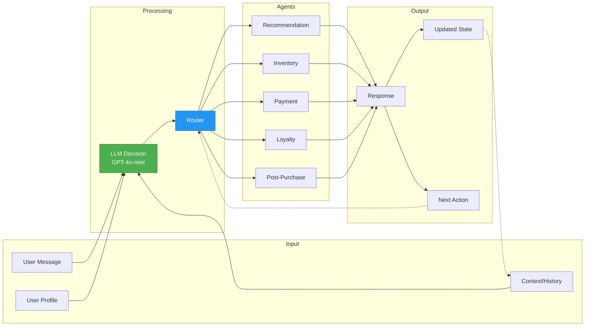
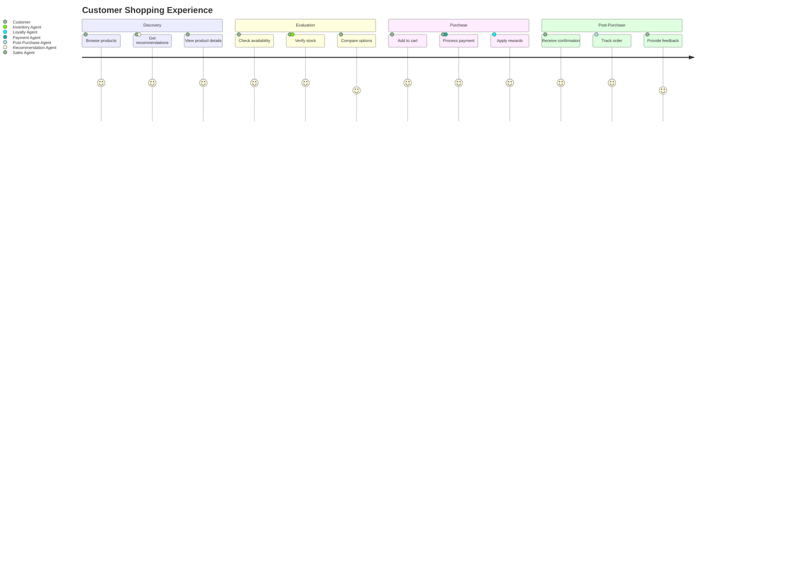
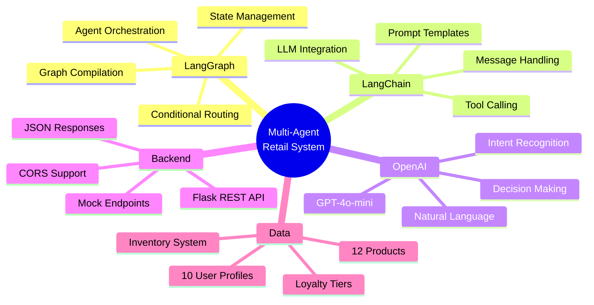
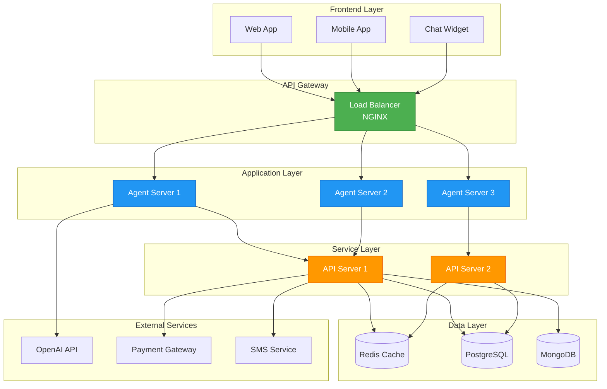

```mermaid
graph TB
    subgraph "Customer Touchpoints"
        WEB[🌠Web Browser]
        MOBILE[📱 Mobile App]
        WHATSAPP[💬 WhatsApp]
        KIOSK[🪠In-Store Kiosk]
        VOICE[🤠Voice Assistant]
    end

    subgraph "Sales Agent (Orchestrator)"
        SA[🤖 Sales Agent<br/>GPT-4o-mini<br/>Intent Understanding<br/>Conversation Flow]
    end

    subgraph "Worker Agents"
        RA[🯠Recommendation Agent<br/>User Profiling<br/>Product Matching<br/>Personalization]
        IA[📦 Inventory Agent<br/>Stock Checking<br/>Store Locator<br/>Delivery Options]
        PA[💳 Payment Agent<br/>Transaction Processing<br/>Order Creation<br/>Receipt Generation]
        LA[ğŸ Loyalty Agent<br/>Points Calculation<br/>Tier Management<br/>Discount Application]
        PPA[📬 Post-Purchase Agent<br/>Order Tracking<br/>Feedback Collection<br/>Returns Handling]
    end

    subgraph "Backend Services"
        API[🔌 Mock API Server<br/>Flask REST API<br/>Port 5000]
        DB[(📊 Data Store<br/>Users: 10<br/>Products: 12<br/>Inventory)]
    end

    subgraph "State Management"
        STATE[ğŸ—‚ï¸ LangGraph State<br/>Conversation Context<br/>User Profile<br/>Cart & Orders]
    end

    WEB --> SA
    MOBILE --> SA
    WHATSAPP --> SA
    KIOSK --> SA
    VOICE --> SA

    SA --> RA
    SA --> IA
    SA --> PA
    SA --> LA
    SA --> PPA

    RA --> API
    IA --> API
    PA --> API
    LA --> API
    PPA --> API

    API --> DB

    SA -.-> STATE
    RA -.-> STATE
    IA -.-> STATE
    PA -.-> STATE
    LA -.-> STATE
    PPA -.-> STATE

    style SA fill:#4CAF50,stroke:#2E7D32,color:#fff
    style RA fill:#2196F3,stroke:#1565C0,color:#fff
    style IA fill:#2196F3,stroke:#1565C0,color:#fff
    style PA fill:#2196F3,stroke:#1565C0,color:#fff
    style LA fill:#2196F3,stroke:#1565C0,color:#fff
    style PPA fill:#2196F3,stroke:#1565C0,color:#fff
    style API fill:#FF9800,stroke:#E65100,color:#fff
    style DB fill:#9C27B0,stroke:#6A1B9A,color:#fff
    style STATE fill:#FFC107,stroke:#F57C00,color:#000
```

# System Flow Diagram

```mermaid
sequenceDiagram
    participant C as Customer
    participant SA as Sales Agent
    participant RA as Recommendation Agent
    participant IA as Inventory Agent
    participant PA as Payment Agent
    participant LA as Loyalty Agent
    participant PPA as Post-Purchase Agent
    participant API as Backend API

    C->>SA: "I'm looking for running shoes"
    SA->>SA: Analyze intent using LLM
    SA->>RA: Route to recommendations
    RA->>API: GET /recommendations/{user_id}
    API-->>RA: Return personalized products
    RA-->>SA: Product list
    SA-->>C: Show 3 top recommendations

    C->>SA: "Are they in stock?"
    SA->>IA: Route to inventory check
    IA->>API: GET /inventory/{sku}
    API-->>IA: Stock status + delivery options
    IA-->>SA: Inventory data
    SA-->>C: "✅ In stock! 45 units available"

    C->>SA: "Let's buy them"
    SA->>PA: Route to payment
    PA->>API: POST /payment
    API-->>PA: Payment successful
    PA-->>SA: Order confirmation
    SA-->>C: "🉠Payment successful!"

    SA->>LA: Route to loyalty
    LA->>API: POST /loyalty/apply
    API-->>LA: Points + discount
    LA-->>SA: Loyalty rewards
    SA-->>C: "🌟 +110 points earned!"

    SA->>PPA: Route to post-purchase
    PPA->>API: POST /post-purchase
    API-->>PPA: Tracking + feedback links
    PPA-->>SA: Follow-up info
    SA-->>C: "📦 Track your order here"
```

# Data Flow

```mermaid
graph LR
    subgraph "Input"
        UI[User Message]
        UP[User Profile]
        CTX[Context/History]
    end

    subgraph "Processing"
        LLM[LLM Decision<br/>GPT-4o-mini]
        ROUTE[Router]
    end

    subgraph "Agents"
        A1[Recommendation]
        A2[Inventory]
        A3[Payment]
        A4[Loyalty]
        A5[Post-Purchase]
    end

    subgraph "Output"
        RESP[Response]
        STATE[Updated State]
        ACTION[Next Action]
    end

    UI --> LLM
    UP --> LLM
    CTX --> LLM
    
    LLM --> ROUTE
    
    ROUTE --> A1
    ROUTE --> A2
    ROUTE --> A3
    ROUTE --> A4
    ROUTE --> A5
    
    A1 --> RESP
    A2 --> RESP
    A3 --> RESP
    A4 --> RESP
    A5 --> RESP
    
    RESP --> STATE
    RESP --> ACTION
    
    STATE -.-> CTX
    ACTION -.-> ROUTE

    style LLM fill:#4CAF50,stroke:#2E7D32,color:#fff
    style ROUTE fill:#2196F3,stroke:#1565C0,color:#fff
```

# User Journey

```mermaid
journey
    title Customer Shopping Experience
    section Discovery
      Browse products: 5: Customer
      Get recommendations: 5: Sales Agent, Recommendation Agent
      View product details: 5: Customer
    section Evaluation
      Check availability: 5: Customer
      Verify stock: 5: Sales Agent, Inventory Agent
      Compare options: 4: Customer
    section Purchase
      Add to cart: 5: Customer
      Process payment: 5: Sales Agent, Payment Agent
      Apply rewards: 5: Loyalty Agent
    section Post-Purchase
      Receive confirmation: 5: Customer
      Track order: 5: Post-Purchase Agent
      Provide feedback: 4: Customer
```

# Technology Stack

```mermaid
mindmap
  root((Multi-Agent<br/>Retail System))
    LangGraph
      State Management
      Agent Orchestration
      Conditional Routing
      Graph Compilation
    LangChain
      LLM Integration
      Message Handling
      Prompt Templates
      Tool Calling
    OpenAI
      GPT-4o-mini
      Intent Recognition
      Natural Language
      Decision Making
    Backend
      Flask REST API
      Mock Endpoints
      JSON Responses
      CORS Support
    Data
      10 User Profiles
      12 Products
      Inventory System
      Loyalty Tiers
```

# Deployment Architecture

```mermaid
graph TB
    subgraph "Frontend Layer"
        WEB[Web App]
        MOBILE[Mobile App]
        CHAT[Chat Widget]
    end

    subgraph "API Gateway"
        GW[Load Balancer<br/>NGINX]
    end

    subgraph "Application Layer"
        AG1[Agent Server 1]
        AG2[Agent Server 2]
        AG3[Agent Server 3]
    end

    subgraph "Service Layer"
        API1[API Server 1]
        API2[API Server 2]
    end

    subgraph "Data Layer"
        REDIS[(Redis Cache)]
        POSTGRES[(PostgreSQL)]
        MONGO[(MongoDB)]
    end

    subgraph "External Services"
        OPENAI[OpenAI API]
        PAYMENT[Payment Gateway]
        SMS[SMS Service]
    end

    WEB --> GW
    MOBILE --> GW
    CHAT --> GW

    GW --> AG1
    GW --> AG2
    GW --> AG3

    AG1 --> API1
    AG2 --> API1
    AG3 --> API2

    API1 --> REDIS
    API2 --> REDIS
    API1 --> POSTGRES
    API2 --> POSTGRES
    API1 --> MONGO

    AG1 --> OPENAI
    API1 --> PAYMENT
    API1 --> SMS

    style GW fill:#4CAF50,stroke:#2E7D32,color:#fff
    style AG1 fill:#2196F3,stroke:#1565C0,color:#fff
    style AG2 fill:#2196F3,stroke:#1565C0,color:#fff
    style AG3 fill:#2196F3,stroke:#1565C0,color:#fff
    style API1 fill:#FF9800,stroke:#E65100,color:#fff
    style API2 fill:#FF9800,stroke:#E65100,color:#fff
```
